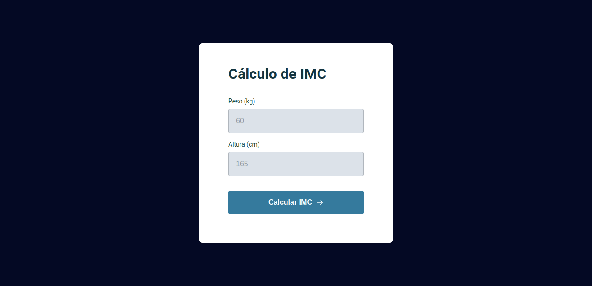

# BMI Calculator
  
> Status: Developed ✅
  
### BMI calculator developed in the Explorer track, promoted by Rocketseat.
To calculate BMI, you need two pieces of data (weight and height), 
after entering these values, the project will show you the final result.

### Technologies used:
* HTML
* CSS
* JAVASCRIPT

Beyond show the answer, the project also show a error message when users fill out with character type text instead number.

### Challenges encountered in developing there projects
I had some difficulties during the development of this project, in Javascript syntax (which I am learning now), and parallel to that, in programming logic. These are points that I will improve as new projects come along.